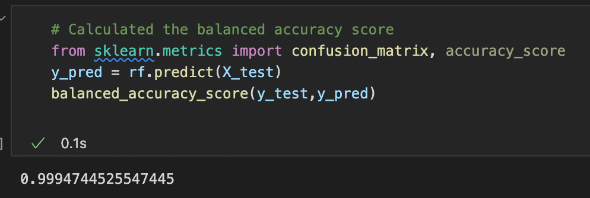
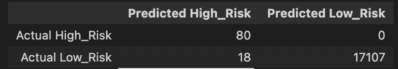
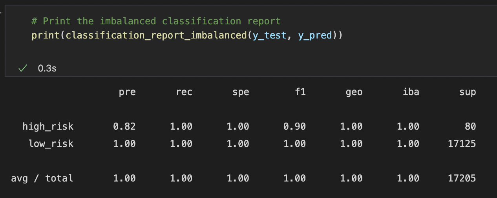
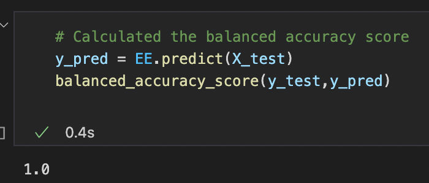
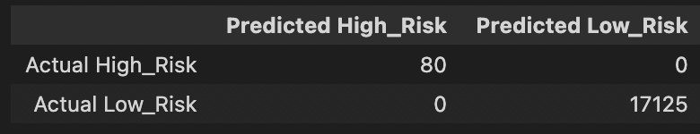
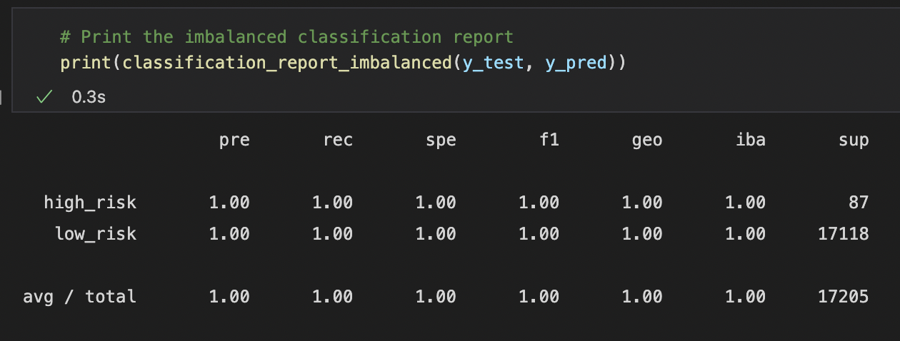

# Overview

This project tests numerous supervised machine learning models for their ability to predict credit risk when evaluating loan applications. 

The following algorithms were used:
- **Oversampling**: 
  - Naive Random Oversampling
  - SMOTE
- **Undersampling**: 
  - Cluster Centroids
- **Combination Sampling**: 
  - SMOTEENN
- **Ensemble Learners**: 
  - Balanced Random Forest Classifier
  - Easy Ensemble AdaBoost Classifier

# Results

## Naive Random Oversampling

- **Balanced Accuracy Score**: 61%
- **Precision**: 1% (High) 100% (Low)
- **Sensitivity**: 56% (High) 66% (Low)
- **F1**: 2% (High) 80% (Low)

## SMOTE

- **Balanced Accuracy Score**: 64%
- **Precision**: 1% (High) 100% (Low)
- **Sensitivity**: 59% (High) 70% (Low)
- **F1**: 2% (High) 82% (Low)

## Cluster Centroids

- **Balanced Accuracy Score**: 50%
- **Precision**: 1% (High) 99% (Low)
- **Sensitivity**: 52% (High) 49% (Low)
- **F1**: 1% (High) 65% (Low)

## SMOTEENN

- **Balanced Accuracy Score**: 64%
- **Precision**: 1% (High) 100% (Low)
- **Sensitivity**: 66% (High) 62% (Low)
- **F1**: 2% (High) 76% (Low)

## Balanced Random Forest Classifier

- **Balanced Accuracy Score**: 99.9%
- **Precision**: 82% (High) 100% (Low)
- **Sensitivity**: 100% (High) 100% (Low)
- **F1**: 90% (High) 100% (Low)

## Easy Ensemble AdaBoost Classifier

- **Balanced Accuracy Score**: 100%
- **Precision**: 100% (High) 100% (Low)
- **Sensitivity**: 100% (High) 100% (Low)
- **F1**: 100% (High) 100% (Low)
  
# Summary
The following chart compares the performance results

|           |Naive ROS|SMOTE|Cluster|SMOTEENN|RndForest |EasyEns  |
|-----------|---------|-----|-------|--------|----------|---------|
|BAS        |61%      |64%  |50%    |64%     |99.9%     |100%     |
|Pre (High) |1%       |1%   |1%     |1%      |82%       |100%     |
|Pre (Low)  |100%     |100% |99%    |100%    |100%      |100%     |
|Rec (High) |56%      |59%  |52%    |66%     |100%      |100%     |
|Rec (Low)  |66%      |70%  |49%    |62%     |100%      |100%     |
|F1 (High)  |2%       |2%   |1%     |2%      |90%       |100%     |
|F1 (Low)   |80%      |82%  |65%    |76%     |100%      |100%     |

## Takeaways

- All models demonstrated high prevision when it came to predicting low credit risk applications
- The resampling algorithms performed poorly when it came to precision for predicting high credit risk scores, all averaging 1%
- Ensemble learners out performed all, with high scores across the board.
- **Winner**: Based on the results above, the ***Easy Ensemble AdaBoost Classifier*** is the clear choice, with 100% across the board.
  - **Note**: This perfect score brings up concerns of overfitting, as such a perfect score is unrealistic in a real world setting