# Overview

This project tests numerous supervised machine learning models for their ability to predict credit risk when evaluating loan applications. 

The following algorithms were used:
- **Oversampling**: 
  - Naive Random Oversampling
  - SMOTE
- **Undersampling**: 
  - Cluster Centroids
- **Combination Sampling**: 
  - SMOTEENN
- **Ensemble Learners**: 
  - Balanced Random Forest Classifier
  - Easy Ensemble AdaBoost Classifier

# Results

## Naive Random Oversampling

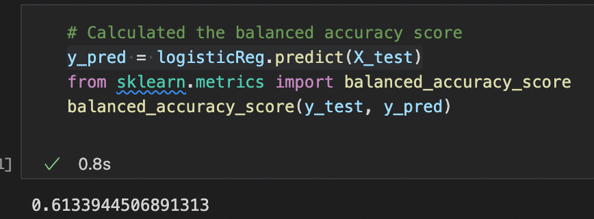

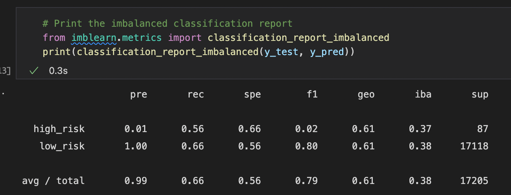

- **Balanced Accuracy Score**: 61%
- **Precision**: 1% (High) 100% (Low)
- **Sensitivity**: 56% (High) 66% (Low)
- **F1**: 2% (High) 80% (Low)

## SMOTE

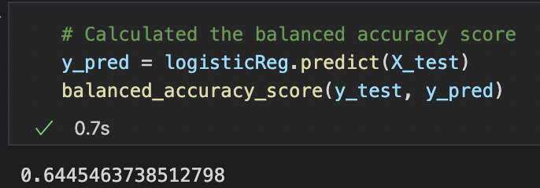
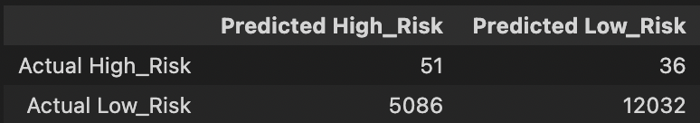
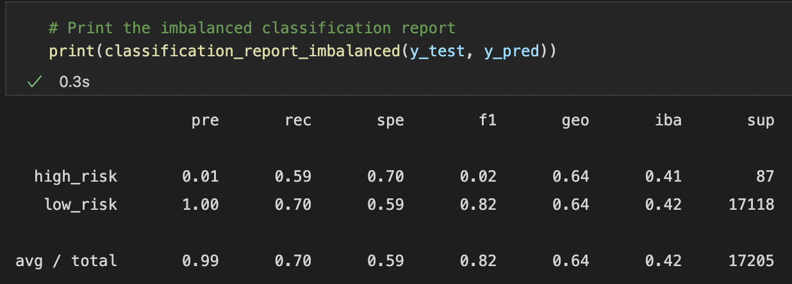

- **Balanced Accuracy Score**: 64%
- **Precision**: 1% (High) 100% (Low)
- **Sensitivity**: 59% (High) 70% (Low)
- **F1**: 2% (High) 82% (Low)

## Cluster Centroids

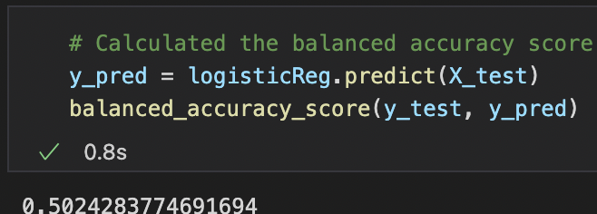
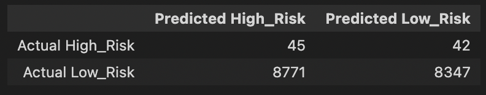
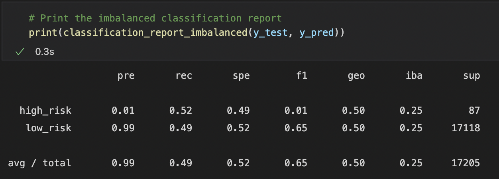

- **Balanced Accuracy Score**: 50%
- **Precision**: 1% (High) 99% (Low)
- **Sensitivity**: 52% (High) 49% (Low)
- **F1**: 1% (High) 65% (Low)

## SMOTEENN
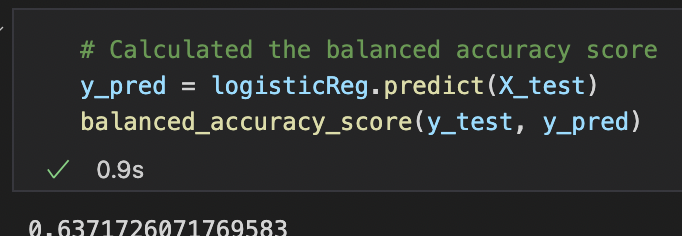
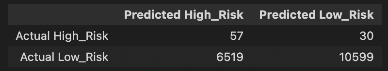
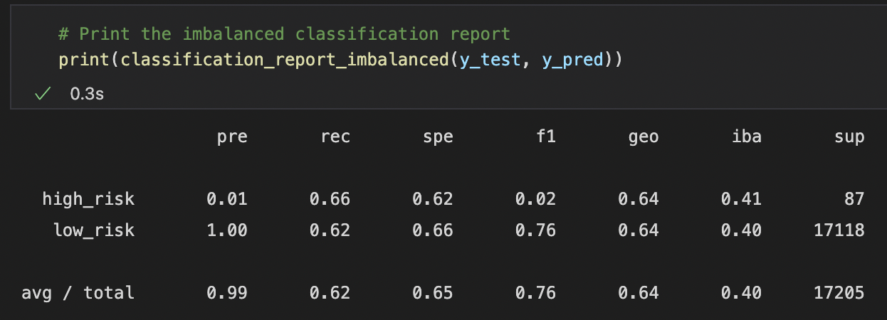

|           |Naive ROS|SMOTE|Cluster|SMOTEENN|
|-----------|---------|-----|-------|--------| 
|BAS        |61%      |64%  |50%    |63%     | 
|Pre (High) |1%       |1%   |1%     |1%      | 
|Pre (Low)  |100%     |100% |99%    |100%    | 
|Rec (High) |56%      |59%  |52%    |66%     | 
|Rec (Low)  |66%      |70%  |49%    |62%     | 
|F1 (High)  |2%       |2%   |1%     |2%      |
|F1 (Low)   |80%      |82%  |65%    |76%     | 