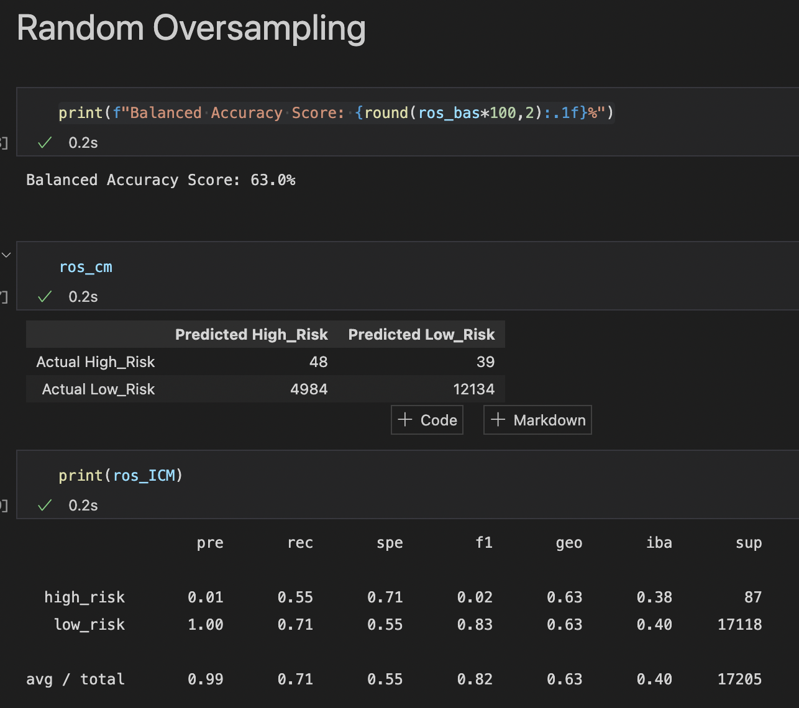
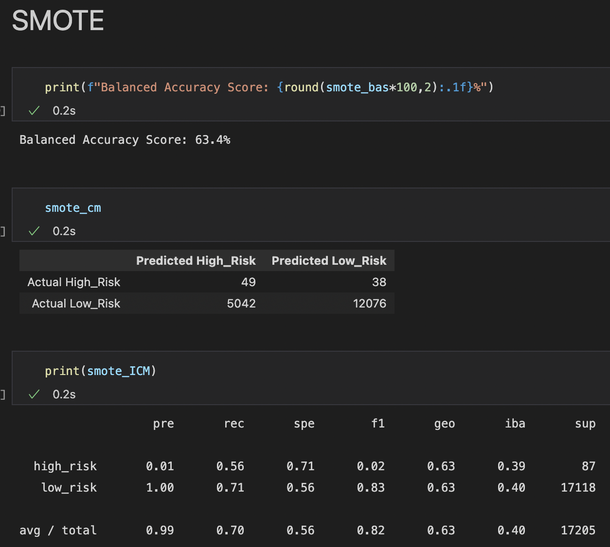
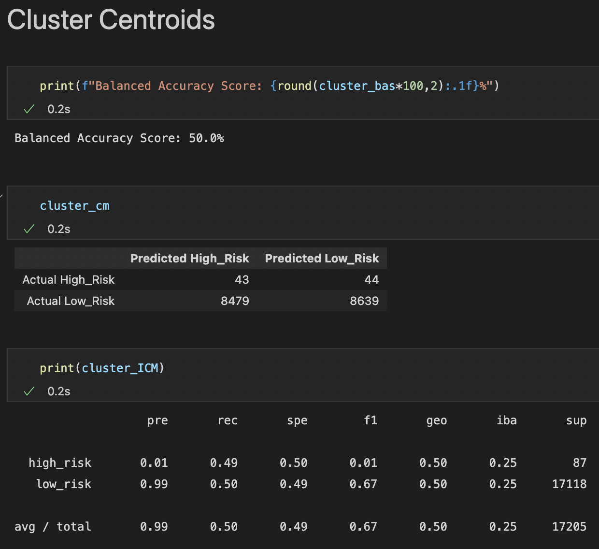
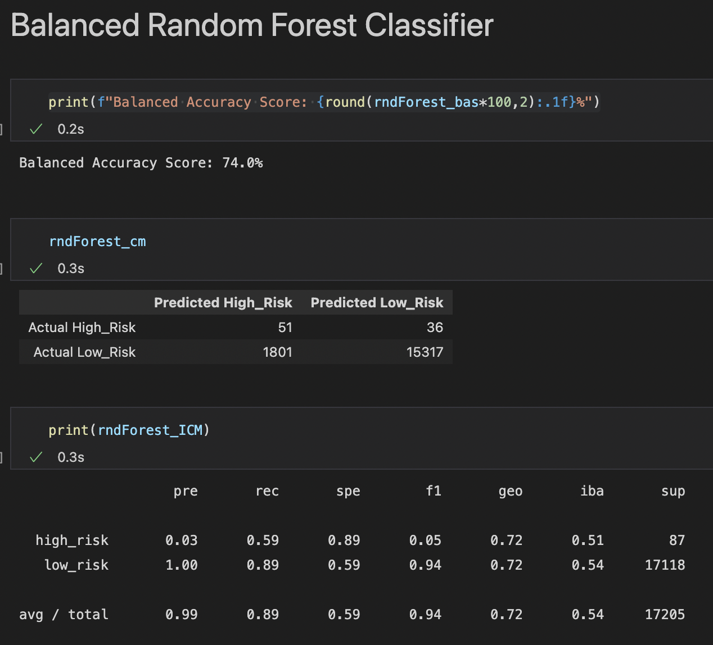
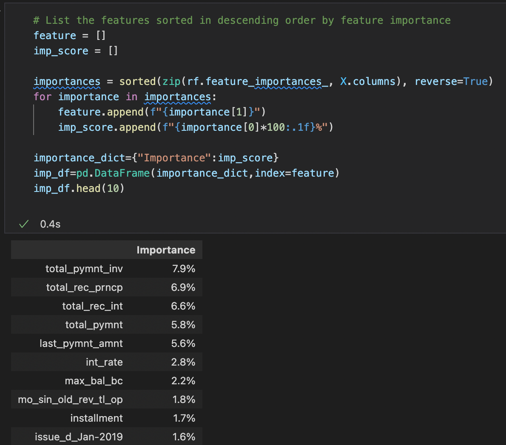
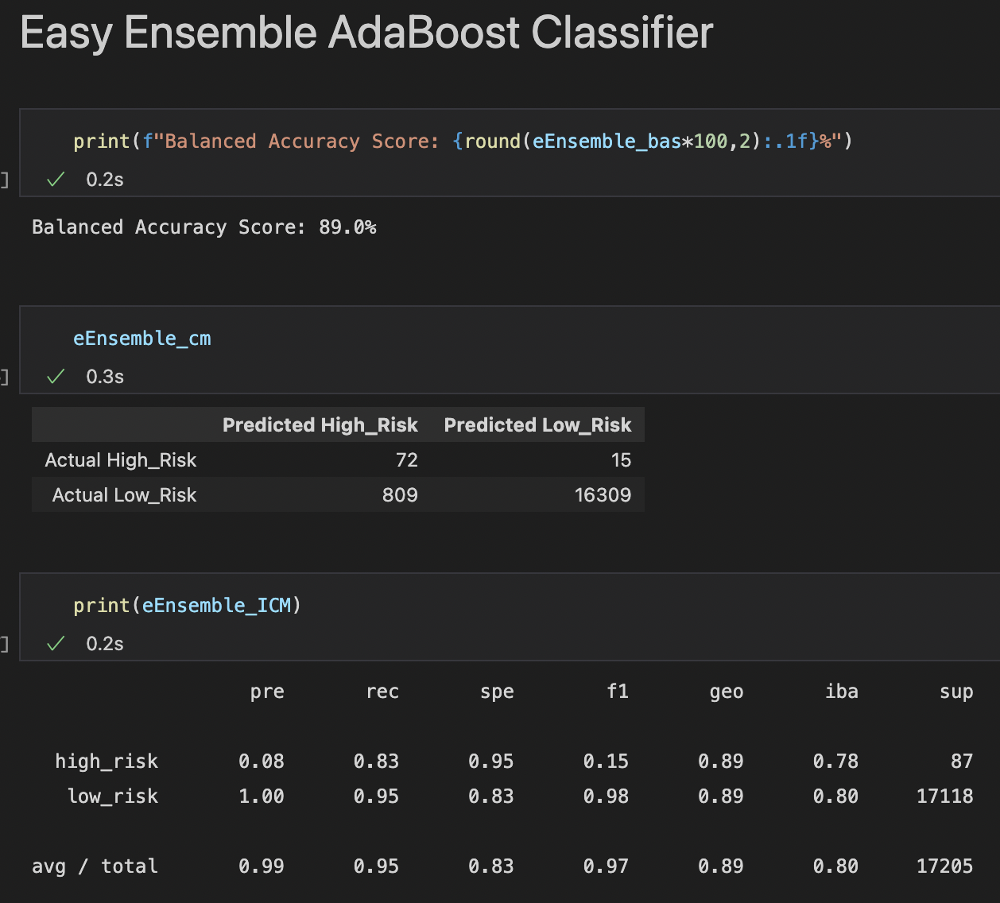

# Overview

This project tests numerous supervised machine learning models for their ability to predict credit risk when evaluating loan applications. 

The following algorithms were used:
- **Oversampling**: 
  - Naive Random Oversampling
  - SMOTE
- **Undersampling**: 
  - Cluster Centroids
- **Combination Sampling**: 
  - SMOTEENN
- **Ensemble Learners**: 
  - Balanced Random Forest Classifier
  - Easy Ensemble AdaBoost Classifier

# Results

## Naive Random Oversampling

- **Balanced Accuracy Score**: 63%
- **Precision**: 1% (High) 100% (Low)
- **Sensitivity**: 55% (High) 71% (Low)
- **F1**: 2% (High) 83% (Low)

## SMOTE

- **Balanced Accuracy Score**: 63.4%
- **Precision**: 1% (High) 100% (Low)
- **Sensitivity**: 56% (High) 71% (Low)
- **F1**: 2% (High) 83% (Low)

## Cluster Centroids

- **Balanced Accuracy Score**: 50%
- **Precision**: 1% (High) 99% (Low)
- **Sensitivity**: 49% (High) 50% (Low)
- **F1**: 1% (High) 67% (Low)

## SMOTEENN

- **Balanced Accuracy Score**: 62.6%
- **Precision**: 1% (High) 100% (Low)
- **Sensitivity**: 62% (High) 63% (Low)
- **F1**: 2% (High) 77% (Low)

## Balanced Random Forest Classifier

### Feature Importance, Ranked

- **Balanced Accuracy Score**: 74%
- **Precision**: 3% (High) 100% (Low)
- **Sensitivity**: 59% (High) 89% (Low)
- **F1**: 5% (High) 94% (Low)

## Easy Ensemble AdaBoost Classifier

- **Balanced Accuracy Score**: 89%
- **Precision**: 8% (High) 100% (Low)
- **Sensitivity**: 83% (High) 95% (Low)
- **F1**: 15% (High) 98% (Low)
  
# Summary
The following chart compares the performance results

|           |Naive ROS|SMOTE|Cluster|SMOTEENN|RndForest |EasyEns  |
|-----------|---------|-----|-------|--------|----------|---------|
|BAS        |63%      |63.4%|50%    |62.6%   |74%       |89%      |
|Pre (High) |1%       |1%   |1%     |1%      |3%        |8%       |
|Pre (Low)  |100%     |100% |99%    |100%    |100%      |100%     |
|Rec (High) |55%      |56%  |49%    |62%     |59%       |83%      |
|Rec (Low)  |71%      |71%  |50%    |63%     |89%       |95%      |
|F1 (High)  |2%       |2%   |1%     |2%      |5%        |15%      |
|F1 (Low)   |83%      |83%  |67%    |77%     |94%       |98%      |

## Takeaways

- All models demonstrated high precision when it came to predicting low credit risk applications
- All performed poorly when it came to precision for predicting high credit risk scores - though the Ensemble Learners performed *slightly* better
- Ensemble learners out performed all, with high scores across the board.
- **Winner**: Based on the results above, the ***Easy Ensemble AdaBoost Classifier*** is the clear choice, with 100% across the board.
  - **Note**: This perfect score brings up concerns of overfitting, as such a perfect score is unrealistic in a real world setting