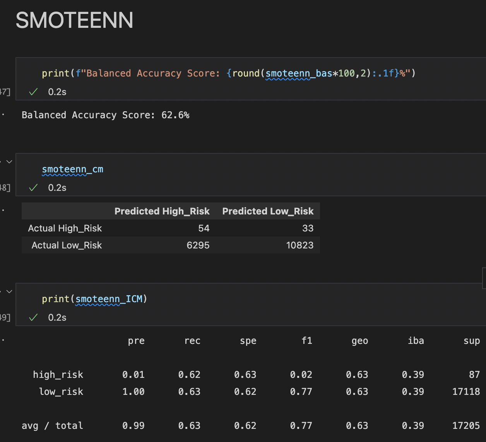

# Overview

This project tests numerous supervised machine learning models for their ability to predict credit risk when evaluating loan applications. 

The following algorithms were used:
- **Oversampling**: 
  - Naive Random Oversampling
  - SMOTE
- **Undersampling**: 
  - Cluster Centroids
- **Combination Sampling**: 
  - SMOTEENN
- **Ensemble Learners**: 
  - Balanced Random Forest Classifier
  - Easy Ensemble AdaBoost Classifier

# Results

## Naive Random Oversampling

- **Balanced Accuracy Score**: 63%
- **Precision**: 1% (High) 100% (Low)
- **Sensitivity**: 55% (High) 71% (Low)
- **F1**: 2% (High) 83% (Low)

## SMOTE

- **Balanced Accuracy Score**: 63.4%
- **Precision**: 1% (High) 100% (Low)
- **Sensitivity**: 56% (High) 71% (Low)
- **F1**: 2% (High) 83% (Low)

## Cluster Centroids

- **Balanced Accuracy Score**: 50%
- **Precision**: 1% (High) 99% (Low)
- **Sensitivity**: 49% (High) 50% (Low)
- **F1**: 1% (High) 67% (Low)

## SMOTEENN

- **Balanced Accuracy Score**: 62.6%
- **Precision**: 1% (High) 100% (Low)
- **Sensitivity**: 62% (High) 63% (Low)
- **F1**: 2% (High) 77% (Low)

## Balanced Random Forest Classifier

### Feature Importance, Ranked

- **Balanced Accuracy Score**: 74%
- **Precision**: 3% (High) 100% (Low)
- **Sensitivity**: 59% (High) 89% (Low)
- **F1**: 5% (High) 94% (Low)

## Easy Ensemble AdaBoost Classifier

- **Balanced Accuracy Score**: 89%
- **Precision**: 8% (High) 100% (Low)
- **Sensitivity**: 83% (High) 95% (Low)
- **F1**: 15% (High) 98% (Low)
  
# Summary
The following chart compares the performance results

|           |Naive ROS|SMOTE|Cluster|SMOTEENN|RndForest |EasyEns  |
|-----------|---------|-----|-------|--------|----------|---------|
|BAS        |63%      |63.4%|50%    |62.6%   |74%       |89%      |
|Pre (High) |1%       |1%   |1%     |1%      |3%        |8%       |
|Pre (Low)  |100%     |100% |99%    |100%    |100%      |100%     |
|Rec (High) |55%      |56%  |49%    |62%     |59%       |83%      |
|Rec (Low)  |71%      |71%  |50%    |63%     |89%       |95%      |
|F1 (High)  |2%       |2%   |1%     |2%      |5%        |15%      |
|F1 (Low)   |83%      |83%  |67%    |77%     |94%       |98%      |

## Takeaways

- **Precision - Low Credit Risk**: All models demonstrated high precision when it came to predicting low credit risk applications
- **Precision - High Credit Risk**: All performed poorly when it came to precision for predicting high credit risk scores
- **F1 - High Credit Risk**: Again, another poor performance across the board. 

### Top Performer
The **Easy Ensemble AdaBoost Classifier** was the top performer out of all algorithms, showing incredibly high precision and recall when predicting low credit scores.
- 100% Precision
- 95% Recall
- 98% F1

However, the Easy Ensemble AdaBoost Classifier was a mixed bag in terms of predicting high risk credit scores
- 8% Precision
- 85% Recall
- 15% F1

**Summary of results**: Low precision but high recall when predicting high credit risk applications means that while most high risk applications will be categorized correctly, many low credit risk applications will also be incorrectly labeled as high risk.

### Conclusion

As with most business decisions, risk acceptance is typically handled by the business and potential customer loss must be accounted for. Is it more costly to incorrectly deny a large amount of loan applications than it is to eat the losses accrued through defaulted loans?

Assuming high risk loan application avoidance is more preferable, and given that the Easy Ensemble AdaBoost Classifier still performs exceptionally well when detecting low risk credit applications (regardless of the batch that are incorrectly categorized as high risk), then the **Easy Ensemble AdaBoost Classifier would be the recommended algorithm to use**.
